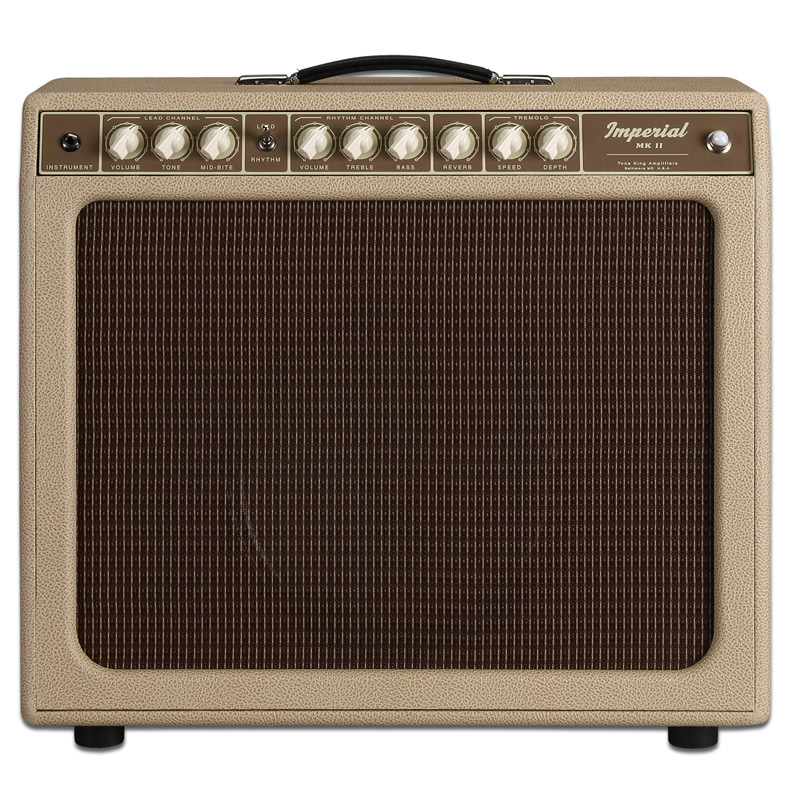
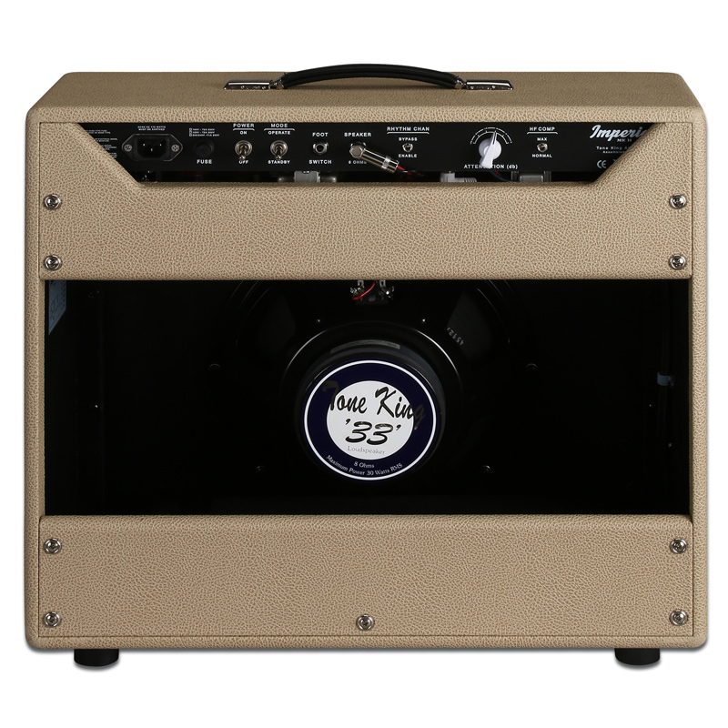
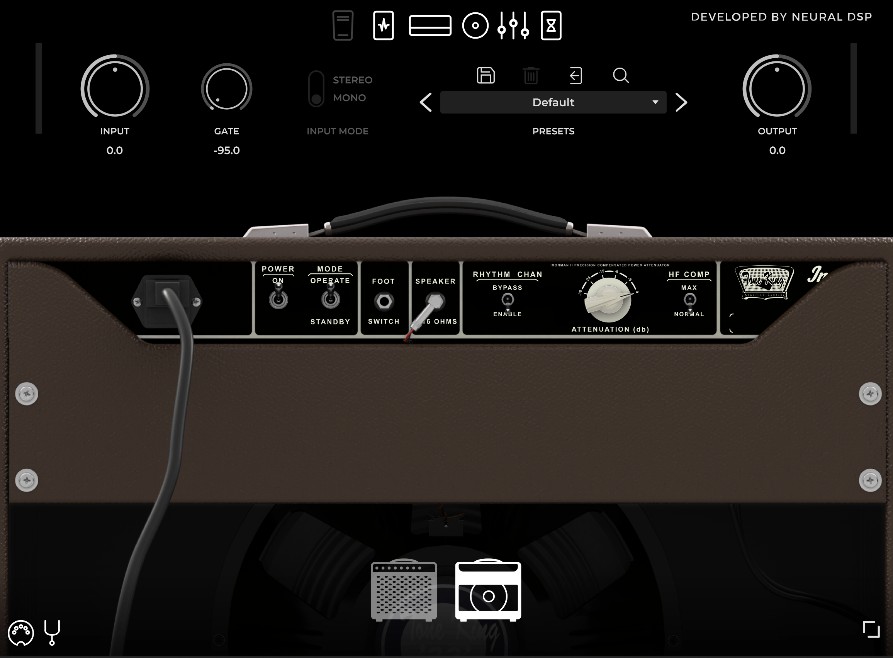

## The current state of the guitar amp tone debate: tube amps, pedals, solid state and digital modelling/profiling

Most likely, anyone who plays electric guitar these days has stumbled upon a YouTube video showcasing some piece of gear. Looking it up ourselves or having it shown to us either by a friend or "the algorithm", gear talk on the internet and especially on YouTube has become all but inevitable. Many people make up their minds about which gear to like or dislike based on videos and opinion interchange in internet forums such as The Gear Page, VI-Control, Gear Space and also the YouTube comments section itself. There, groups form around reverence or disdain for certain pieces of equipment, in an interesting shift from the classic Sociology-friendly genre-centric cleavages of old.

Of course, the provocation doesn't mean to suggest that, 1, the splits between people in these forums around, say, a pedal like the Klon Centaur or Fender amplifiers haven't existed for a long time and, 2, that they aren't suitable to some sort of sociological treatment. However, it's interesting to note that before the internet, as people say, debate around musical genre used to engage much more people. This isn't a topic we can get into here, but the second one, that is, to throw a sociological gaze on how people address their gear choices is what interests me here.

In discussing this, the main underlying theme I'd like us to keep in mind is that of democratization. We'll come back to it throughout the text, so at this point it might be worth outlining a baseline understanding of it. Democracy and its advances and reverses throughout History form a complex theme that obviously can't be dealt with here, so let us limit the scope of what we'll be dealing with in this article. I'm particularly interested in forces that enable people to acquire knowledge and broadcast what they make with this knowledge. More specifically, I'm interested in how people's artistic aspirations can be set in motion and eventually released and what affords them these channels and catalysts. This all eventually feeds back into more general democratizing processes such as struggles for rights, against oppression or representativity - or at least that's what was widely believed.[^darnton]

Technology has been hailed as an enabler of democratization - hence a democratizing force in itself - at least since the beginning of the internet age.[^internetAndTech] That was when the two things - tech and the internet - started being conflated to the point of now having become almost synonymous. Today, more than ever, there's practically no technological affair that isn't *connected* to the internet - the pun wasn't intentional, but it ended up being useful - and democratizing forces end up being sort of being channeled into and by the dyad internet/technology. Covering a broad spectrum that touches on digital rights activism, the free culture movement, Wikipedia, the blogosphere (remember that?), "copyfight", software and media piracy, free and open source software, crowdfunding, self-publishing initiatives, cryptocurrencies, podcasting, the current "value-for-value" initiatives, grassroots journalism, the so-called Arab Spring and even YouTube, technology is the common enabler to all of these phenomena. Phenomena that, by its turn, can be regarded as democratizing in sense or another.

### Guitar software and hardware

When it comes to the discussion about democratization and technology involving music, there are multiple points of entry: for instance, streaming and piracy made the most varied song catalogs immediately available to millions, while tech-deflation[^techDeflation] put studio-grade, formerly inaccessible gear in the bedrooms of hobbyists. Music software and what it affords in terms of access to high-end equipment is especially characteristic of the larger phenomenon outlined in the previous paragraph.

Music software often builds upon or sometimes plainly tries to replicate what coveted pieces of gear do. We'll discuss some of the methods used to achieve this and their implications below, but the main thing to bear in mind here is that a great deal of music software is based on physical gear that is considered desireable by the "music community"[^musicCommunity], often based on the fact that iconic recordings of the past were made employing that equipment. In comparison to the hardware it often "emulates",[^emulation] software is cheaper (potentially free if we consider piracy), takes less space, is easier to carry around, can be used in much quieter volumes, and consumes less power. All this makes working "in-the-box"[^inTheBox] significantly more attainable to those who can't resort to a traditional studio or something similar. In turn, the means that afford someone the use of a professional studio are above all financial: it costs money to book studio time and the price follows the equipment it possesses,[^studioMojo] but there are also expenses to be accounted for in going to the studio - usually correlated with how far the musician is from one -, there's the time one has to block to be able to spend some hours in that space - as opposed to those who squeeze some music-making time at home whenever they can - and there's the knowing part: the people, where to go, the vocabulary and the codes to interact in a professional studio and everything that comes with it.

Software can either be considered easier or harder to use depending on the user's skill and mindset, but it offers a *kind* of flexibility that hardware rarely achieves. Users can combine software with other pieces of software, can use it in series or in parallel with itself multiple times, can split what it does according to different parameters etc. For example: think about passing a guitar signal through three VOX AC30s with the purpose of achieving whatever three AC30s stacked could do: first of all, you'd have to have three units of this fairly expensive amp. Then each one would have to be mic'ed, hopefully minimizing bleed from one to the other, so you'd need three microphones (assuming you'd mic each one with only one mic) and a room with space and treatment adequate for this to be achieved. Now imagine how loud it would be in a room with three VOX AC30s cranked. One surely couldn't do it in a condo, so think about a studio that offered such a structure to perform this in the analogue realm. This is all trivial with software and is generally equated to offering a degree of flexibility virtually impossible in the physical realm:

	[COLOCAR ALGUMA FALA QUE EXEMPLIFIQUE ISSO]

However, usually hardware gear allows for a kind of intervention on its inner workings that is rare in software due to it requiring, 1, that the source code is available and, 2, that the people interested in working on it have the technical expertise to do so. Granted, not every guitarist has the knowledge and "handy-ness" to get a soldering iron and start messing with pedals, let alone amps. But somehow - at least until the current kids reach adulthood - it is generally considered a lower barrier of entry than tinkering with Digital Signal Processing and the like. This can be verified by the abundance of DIY, modding and BYOC (Build Your Own Clone) forums and by how frequently this route is suggested in discussions in other forums. Conversely, at least to my knowledge, someone suggesting a fellow guitarist should go mess with a plugin's code is fairly of unusual. Maybe there is something here related to the fact that doing small fixes on one's own instrument is usually regarded as an ability a professional musician should possess, and then perhaps it passes over to hardware equipment in general. Software (so far) doesn't occupy a similar position and, at the very least, one needs to have access to the programs' source code to be able to modify it, which is in itself something rare in an industry that is built on the (supposed or real) exclusivity and uniqueness of each maker's algorithms, transforms, implementations etc.[^examplesOfIndustryHype]

All this creates a somewhat predictable divide between the analogue and the digital realms. They would be different in nature, hence incommensurable in the knowledge one brings from one to the other. At the same time, since music software has the tendency to imitate - sometimes to minute detail - the analogue gear it is modelled after, it could be expected that regular use could be translated directly from one to the other. However, forum posts comparing digital versions to "the real deal" are legion. For an example, check the interface of Neural DSP's Tone King Imperial MKII plugin and compare it to a photo of the actual amplifier it tries to replicate:

***

Useful to understand the terms and some underlying ideas to people's arguments

	- though technically digital modelling amps are solid state, here we'll divide the field in three categories: tube amps, solid state amps and digital modelling/profiling amps
	- vacuum tubes: old technology, basically HiFi equipment and guitar amps
		- introduce "harmonic distortion" that "we find pleasing"
			- wattage != loudness
	- solid state amps generally aren't considered capable of offering tube tone
		- this quickly becomes "aren't capable of good tone" (people say they are sterile-sounding)
		- division among guitarists: jazzers tend to be much more open to SS (the Roland Jazz Chorus is a staple), but rock/pop/soul/blues/country guitarists who play "mostly clean" tend not to like SS (Tim Lerch on why he prefers tube perhaps implies that it's the case with Teles)
	- the (classic) divide analog vs digital doesn't hold here: SS is analog and people say a SS amp isn't on par with a tube one
		- there's more people who go back and forth between tubes and digital than those who stick with analog, despite being tube or SS
	- And what about pedals?
		- people are a little less picky with regard to pedals - pedals are also SS and are used "to push clean, 'pedal platform' (tube) amps into overdrive" - but sometimes they are themselves introducing distortion
		- some people will still say "I'd rather use a boost", but at the same time it's common to see people praising overdrive pedals for "behaving like a tube amp"
		- another interesting point is that I've never seen anyone mention the waste of energy that tube amps represent:
			> "Most of the energy loss in classic amp designs occurs because of the need to keep the power tubes operating in their linear range. To function optimally, tubes need to be at a certain temperature–this is why you need to warm up a tube amp before you play it. Most of the power draw of tube amps goes towards keeping the tubes hot, as opposed to amplifying the guitar signal.
			> Class D amps function at around 90% efficiency, meaning that only about 10% of the energy put into them gets released as heat. Classic guitar amplifiers convert anywhere from 70% to 90% of the energy they draw from the wall into heat." (https://georgedyermusic.com/2016/11/24/how-do-quilter-amps-work/ Oct 4 2023)
				- attributed to Pat Quilter: an electron doesn't know if it's a tube or a transistor; you have to voice it right
				- Josh Scott: germanium vs silicon (talking about different transistors, but the similarity with Quilter's argument is interesting), it doesn't really matter; what matters is how you voice the pedal
				- The Gear Page user: "Digital modelling might be the missing ingredient in closing the gap between tubes and solid state." (https://www.thegearpage.net/board/index.php?threads/quilter-disappointment.2321918/post-33936105 Oct 4 2023)
		
	
## Three camps, two paradigms:
- we can talk about two paradigms:
		- the traditional paradigm: tube amps, hard (heavy) to carry around, knobs, plug and play, direct control of defined parameters (which are in principle discrete, but there can be a lot of interaction between them when you dig), more flexibility (easier) in terms of how adjust it on the fly (one feature of tube amps is that they change their tone according to temperature and energy source, for example);
		- the digital paradigm: software emulation (a brief discussion about the word "emulation"), having to scroll through (endless) menus, harder to tweak on the fly, at the same time tone is always the same, so it's predictable/reliable, light to carry around - but many times you don't carry because they are in computers at home that "bedroom guitarists" use (vs pros, who graduate to tube amps - but the A-level pros (who play with big acts) have been using (and publicizing) more and more modellers for their dependability and predictability). The solutions for gigging musicians try to bridge the gap between the immediacy of hardware solutions and the main selling points of the digital ones.

	- "Nothing does what a tube does and nothing ever will"
		- Countered by "Ok Boomer" - accusations of elitism, conservatism, superstition
	- "Amp-modelling technology has matured and is now (virtually) indistinguishable
		- Countered by "they've never even experienced a tube doing its thing properly due to various circumstances involving generation, financial means, and lack of opportunity (no space to crank an amp, no vintage "true" equipment within reach)
	
	- Middle ground, various arguments and different positions:
		- "It sounds just like tubes, but feels different under the fingers"
			- Countered by "I've never even experienced the real thing... so what it doesn't feel the same?" - I've never seen anyone say it feels different and it's better this way **and this is something interesting**
		- "It doesn't sound just like tubes, but it doesn't matter in practice"
			- Countered by "but what about how the player feels about it?", "The player plays better if they feel it the way they themselves like it"
			- Also countered by the "Death by a thousand cuts" argument
			
## The JHS Kemper story

## NAM and the open source discussion
- modelling and profiling
- null tests
- NAM vs Kemper/QC/Fractal/Helix/ToneX/etc
- against elitism, lowering barrier of entry
	- curiously, the argument of "feel" surfaced as the tone became indistinguishable
		- how quick the amp responds (SS is faster, but some people claim - in other contexts, meaning, when discussing only tube amps - that there is difference according to speaker - why not bring the speaker thing in this case too?)
		- mushiness and compression (Quilters usually have a compressor/limiter built-in to match the feel of tube amps, at the same time the Two-Rock guy says he doesn't like compression and works to have his amps - usually considered state-of-the-art in terms of boutique tube amps - to compress as little as posssible (Dipped in Tone interview))
	- isn't this "nothing but tubes" thing some form of keeping the outsiders/children in their place?
	- creates the feeling of "when I grow up, I'll go tubes" - "As most players tend to graduate to tube amps from solid-state amplifiers, they (tube amps) can be known as more aspirational amplifiers – something that you 'graduate' to" (https://www.laney.co.uk/blog/solid-state-vs-tube-amps-why-be-forced-to-choose/#:~:text=Solid%2Dstate%20amps%20don%27t,way%20as%20a%20tube%20amp, Oct 4 2023).
	- discussions that tap into the Open Source character of NAM to criticize people selling profiles:
		- "for the people, by the people" or, even better, "for us, by us", as a user put it
		- misunderstanding of what OSS actually implies and accusations by others of being "freeloaders"

People who know nothing about transistors:
https://www.tdpri.com/threads/quilter-amps-what-are-your-thoughts.953963/post-9127734
The thing that bugs me about all the posts that say what you can't do with transistors is that my guess is that those who are saying that *probably* don't really know anything about how transistors work. I suppose they might... but anyone who knows how transistors work likely would NEVER say such things.

True... if you take a tube amp and replace each stage with a similar transistor-based stage then what you get will NEVER sound like what a tube amp sounds like. And that is EXACTLY what happened with the very first solid-state amps... and why they sounded bad. 

But... transistors are very versatile building blocks and we can put millions of them on a chip and create some very complicated things. And engineers understand precisely how to do these kind of things. And that is what Quilter has done. They use millions of transistors to create circuits that come pretty close to having the same overall input-output function of a tube amp... Is it perfectly the same? Probably not. Is it pretty close? Probably. Will some players be OK with it and others not? Yes. It will depend on the player as well as the job - and its various constraints - that the player is trying to accomplish.

I've never played a Quilter amp... nor have a played any other recent solid-state amps. I play either tube amps (that I've designed and built myself) or I use a modeling amp (which also use millions or billions of transistors to mimic tubes in a very different way... but the main idea is the same - replace a circuit with a number of tubes that you can count on both hands with millions or billions of transistors). But how do I know that solid-state amplifiers have this potential? Because I've been teaching circuits and electronics at the university level for over 20 years. It is very easy to underestimate what *can* be done with transistors - especially if your view is colored by the many horrible SS amps that have been made over the decades. But just because someone built the pinto does not mean that someone else can't build a Ferrari out of pretty much the same technology.

So... the Quilters probably sound pretty good (because the guy who designed them took a very different approach from what led to the original SS amps) and he has a pretty good track record as an excellent analog circuit designer)... but if you don't like them that is fine - just don't say that fundamentally you can NEVER design a SS amp that sounds good.

(mfowler314) - Oct 4 2023

A few posts below:
Ian T said:
This is why 40+ years later, tube amps continue to prevail in most professional rigs. Tubes and transistors sound different, period. Digital modeling has made better progress than analog solid state, however, but that's another topic.

Fowler:
You are partly right here. Tube amps do still prevail but that is not based solely on the sound of the current generation of SS amps. There are many reasons that tube amps are still preferred by many - myself included (I like them because they sound good, they are simple, and I can design, build, and modify them to my heart's content). A big part of it is that early SS amps were so horrible... and that makes lots of people (yourself included) constantly imply that *no* SS amp can ever sound good... period. It is a culture thing based on decades of bad SS amps. But you have to admit that today's SS amps sound nothing like the old ones... they keep getting better. And we are at the point where some players (and not only bedroom players) look at all the factors and decide that a SS amp meets their needs.

[^darnton]: For but one far more general consideration of the same type of process, see Robert Darnton's classic works on pre-revolutionary France and the ensuing debate - Darnton, Boemia Literaria e Rev, The Business of Enlightenment and also The Darnton debate. See also the works cited in the next paragraph for something more directly related to our discussion.
[^internetAndTech]: For just a few examples, see Lessig, Free Culture; Doctorow, Information Doesn't Want to be Free; Howard Rheingold, Smart Mobs.
[^techDeflation]: The phenomenon by which technological advancement in the form of economies of scale, increased efficiency, and improvements in production processes leads to previously expensive goods getting cheaper and thus popularized.
[^musicCommunity]: Yes, of course, *what* is the music community? *Who*'s part of if and who's not? Who gets to choose the members of the club? Albeit briefly, we'll touch on this topic below when discussing internet forums and YouTube.
[^he term "ems to have stuck, but it's not entirely accurate, as ns imitating with the intent of surpassing, usually being a somewhat flattering move. What this software does is actually trying to match, to create a form of simulation, a digital replication of the sound and usually also the behavior of the physical gear it's modelled after.
[^inTheBox]: Term used to refer to when someone does all the processing in the computer, simply plugging the instrument straight into the interface.
[^studioMojo]: Interestingly - and this is something we'll have to hold off from discussing today, as it would lead us on a too long detour -, tech-deflation is countered here by the expectation that studios - at least the ones that deserve a musician's money - will have "the real deal" gear to offer, which means standard pro-grade equipment and hopefully some vintage well-known pieces of equipment for "mojo".
[^examplesOfIndustryHype]: Dar alguns exemplos de anúncions do tipo "com nosso algoritmo exclusivo" etc.