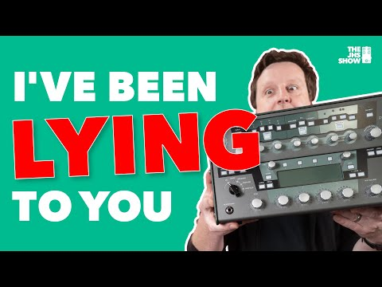

## (You)Tube guitar amplifiers:
## JHS and the Kemper affair
### Frederico Barros
##### Federal University of Rio de Janeiro (Brazil)

---
## The JHS-Kemper affair

"We turn it on, but it’s on standby, and if you’ve paid any attention you’ll see that the knobs are down and stuff because we got lazy. The Kemper just let us be lazy; it was more creating, less doing." Josh Scott

<!-- Note: https://www.guitarworld.com/news/jhs-show-using-kemper-not-tube-amp (accessed Oct 4 2023) -->

---
## Current state of the guitar amp tone debate: tube amps, pedals, solid state and digital modelling/profiling
---

Useful to understand the terms and some underlying ideas to people's arguments

	- though technically digital modelling amps are solid state, here we'll divide the field in three categories: tube amps, solid state amps and digital modelling/profiling amps
	- vacuum tubes: old technology, basically HiFi equipment and guitar amps
		- introduce "harmonic distortion" that "we find pleasing"
			- wattage != loudness
	- solid state amps generally aren't considered capable of offering tube tone
		- this quickly becomes "aren't capable of good tone" (people say they are sterile-sounding)
		- division among guitarrists: jazzers tend to be much more open to SS (the Roland Jazz Chorus is a staple), but rock/pop/soul/blues/country guitarrists who play "mostly clean" tend not to like SS (Tim Lerch on why he prefers tube perhaps implies that it's the case with Teles)
	- the (classic) divide analog vs digital doesn't hold here: SS is analog and people say a SS amp isn't on par with a tube one
		- there's more people who go back and forth between tubes and digital than those who stick with analog, despite being tube or SS
			- attributed to Pat Quilter: an electron doesn't know if it's a tube or a transistor; you have to voice it right
			- Josh Scott: germanium vs silicon (talking about different transistors, but the similarity with Quilter's argument is interesting), it doesn't really matter; what matters is how you voice the pedal
			- The Gear Page user: "Digital modelling might be the missing ingredient in closing the gap between tubes and solid state." (https://www.thegearpage.net/board/index.php?threads/quilter-disappointment.2321918/post-33936105 Oct 4 2023)
		
### Complexifying:
	- people are a little less picky with regard to pedals - pedals are also SS and are used "to push clean, 'pedal platform' (tube) amps into overdrive" - but sometimes they are themselves introducing distortion
	- some people will still say "I'd rather use a boost", but at the same time it's common to see people praising overdrive pedals for "behaving like a tube amp"
	- another interesting point is that I've never seen anyone mention the waste of energy that tube amps represent:
		> "Most of the energy loss in classic amp designs occurs because of the need to keep the power tubes operating in their linear range. To function optimally, tubes need to be at a certain temperature–this is why you need to warm up a tube amp before you play it. Most of the power draw of tube amps goes towards keeping the tubes hot, as opposed to amplifying the guitar signal.
		> Class D amps function at around 90% efficiency, meaning that only about 10% of the energy put into them gets released as heat. Classic guitar amplifiers convert anywhere from 70% to 90% of the energy they draw from the wall into heat." (https://georgedyermusic.com/2016/11/24/how-do-quilter-amps-work/ Oct 4 2023)
	
## Three camps:
	- "Nothing does what a tube does and nothing ever will"
		- Countered by "Ok Boomer" - accusations of elitism, conservatism, superstition
	- "Amp-modelling technology has matured and is now (virtually) indistinguishable
		- Countered by "they've never even experienced a tube doing its thing properly due to various circumstances involving generation, financial means, and lack of opportunity (no space to crank an amp, no vintage "true" equipment within reach)
	
	- Middle ground, various arguments and different positions:
		- "It sounds just like tubes, but feels different under the fingers"
			- Countered by "I've never even experienced the real thing... so what it doesn't feel the same?" - I've never seen anyone say it feels different and it's better this way **and this is something interesting**
		- "It doesn't sound just like tubes, but it doesn't matter in practice"
			- Countered by "but what about how the player feels about it?", "The player plays better if they feel it the way they themselves like it"
			- Also countered by the "Death by a thousand cuts" argument
			

## NAM and the open source discussion
- modelling and profiling
- null tests
- NAM vs Kemper/QC/Fractal/Helix/ToneX/etc
- against elitism, lowering barrier of entry
	- curiously, the argument of "feel" surfaced as the tone became indistinguishable
		- how quick the amp responds (SS is faster, but some people claim - in other contexts, meaning, when discussing only tube amps - that there is difference according to speaker - why not bring the speaker thing in this case too?)
		- mushiness and compression (Quilters usually have a compressor/limiter built-in to match the feel of tube amps, at the same time the Two-Rock guy says he doesn't like compression and works to have his amps - usually considered state-of-the-art in terms of boutique tube amps - to compress as little as posssible (Dipped in Tone interview))
	- isn't this "nothing but tubes" thing some form of keeping the outsiders/children in their place?
	- creates the feeling of "when I grow up, I'll go tubes" - "As most players tend to graduate to tube amps from solid-state amplifiers, they (tube amps) can be known as more aspirational amplifiers – something that you 'graduate' to" (https://www.laney.co.uk/blog/solid-state-vs-tube-amps-why-be-forced-to-choose/#:~:text=Solid%2Dstate%20amps%20don%27t,way%20as%20a%20tube%20amp, Oct 4 2023).
	- discussions that tap into the Open Source character of NAM to criticize people selling profiles:
		- "for the people, by the people" or, even better, "for us, by us", as a user put it
		- misunderstanding of what OSS actually implies and accusations by others of being "freeloaders"

People who know nothing about transistors:
https://www.tdpri.com/threads/quilter-amps-what-are-your-thoughts.953963/post-9127734
The thing that bugs me about all the posts that say what you can't do with transistors is that my guess is that those who are saying that *probably* don't really know anything about how transistors work. I suppose they might... but anyone who knows how transistors work likely would NEVER say such things.

True... if you take a tube amp and replace each stage with a similar transistor-based stage then what you get will NEVER sound like what a tube amp sounds like. And that is EXACTLY what happened with the very first solid-state amps... and why they sounded bad. 

But... transistors are very versatile building blocks and we can put millions of them on a chip and create some very complicated things. And engineers understand precisely how to do these kind of things. And that is what Quilter has done. They use millions of transistors to create circuits that come pretty close to having the same overall input-output function of a tube amp... Is it perfectly the same? Probably not. Is it pretty close? Probably. Will some players be OK with it and others not? Yes. It will depend on the player as well as the job - and its various constraints - that the player is trying to accomplish.

I've never played a Quilter amp... nor have a played any other recent solid-state amps. I play either tube amps (that I've designed and built myself) or I use a modeling amp (which also use millions or billions of transistors to mimic tubes in a very different way... but the main idea is the same - replace a circuit with a number of tubes that you can count on both hands with millions or billions of transistors). But how do I know that solid-state amplifiers have this potential? Because I've been teaching circuits and electronics at the university level for over 20 years. It is very easy to underestimate what *can* be done with transistors - especially if your view is colored by the many horrible SS amps that have been made over the decades. But just because someone built the pinto does not mean that someone else can't build a Ferrari out of pretty much the same technology.

So... the Quilters probably sound pretty good (because the guy who designed them took a very different approach from what led to the original SS amps) and he has a pretty good track record as an excellent analog circuit designer)... but if you don't like them that is fine - just don't say that fundamentally you can NEVER design a SS amp that sounds good.

(mfowler314) - Oct 4 2023

A few posts below:
Ian T said:
This is why 40+ years later, tube amps continue to prevail in most professional rigs. Tubes and transistors sound different, period. Digital modeling has made better progress than analog solid state, however, but that's another topic.

Fowler:
You are partly right here. Tube amps do still prevail but that is not based solely on the sound of the current generation of SS amps. There are many reasons that tube amps are still preferred by many - myself included (I like them because they sound good, they are simple, and I can design, build, and modify them to my heart's content). A big part of it is that early SS amps were so horrible... and that makes lots of people (yourself included) constantly imply that *no* SS amp can ever sound good... period. It is a culture thing based on decades of bad SS amps. But you have to admit that today's SS amps sound nothing like the old ones... they keep getting better. And we are at the point where some players (and not only bedroom players) look at all the factors and decide that a SS amp meets their needs.